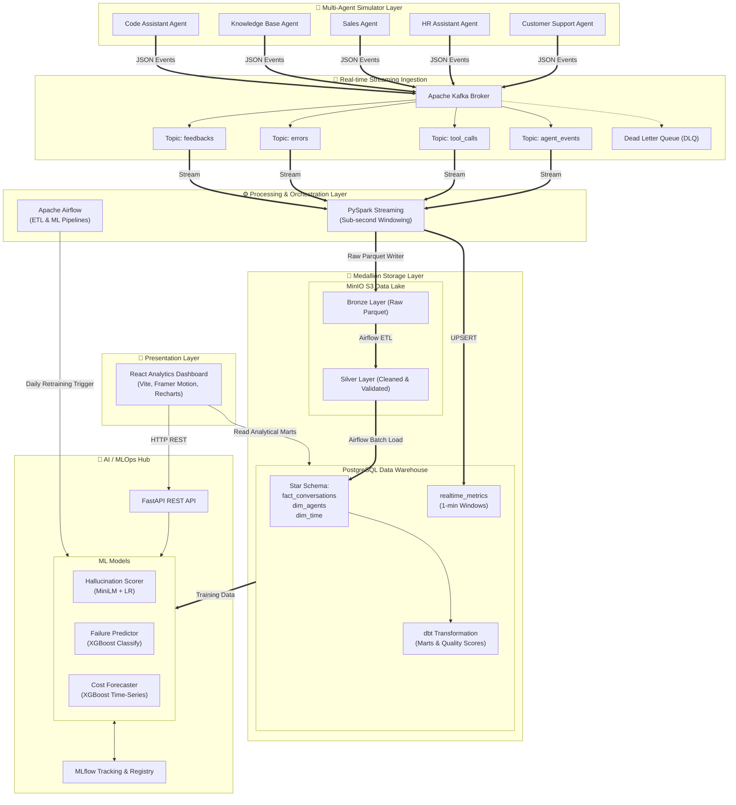

# ⚡ AgentOps Platform

> **Enterprise-Grade AI Agent Observability, Evaluation & Real-Time Analytics System**

[](https://github.com/yourusername/agentops-platform/actions)
[](LICENSE)
[](https://github.com/yourusername/agentops-platform/pulls)
[](docker-compose.yml)

AgentOps Platform is a **production-grade Data Engineering & AI/MLOps portfolio project** that monitors, evaluates, and optimizes multi-agent LLM systems at scale. The platform processes real-time event streams from 5 active simulator agents, runs streaming and batch ETL pipelines, maintains a highly optimized Medallion Data Lake, serves real-time ML inference for evaluation, and exposes insights through a premium Glassmorphism React dashboard.

---

## 🌟 Core Highlights & Capabilities

* **Real-Time Stream Processing**: Consumes millions of agent conversational events, tool executions, and errors via **Apache Kafka** and aggregates metrics in sub-second windows using **PySpark Structured Streaming**.
* **Medallion Data Lake Architecture**: Stores raw streaming records in **MinIO** (Bronze), runs robust validation/deduplication batch scripts via **Apache Airflow** (Silver), and computes analytical metrics (Gold).
* **dbt-Driven Data Warehouse**: Models a robust Star Schema in **PostgreSQL** using **dbt**, producing optimized data marts, composite metrics, and historical snapshot models.
* **ML Evaluation Suite**:
  * **Hallucination Detection**: Sentence-Transformers (`all-MiniLM-L6-v2`) embedded similarity modeling with a Logistic Regression probability scorer.
  * **Agent Failure Prediction**: Real-time XGBoost binary classification assessing failure risks based on latency, tokens, and tool usage.
  * **Cost Forecasting**: XGBoost time-series regressor with confidence intervals forecasting multi-agent costs 7 days ahead.
* **Premium React Dashboard**: A stunning, modern dark-mode user interface designed with a Glassmorphism theme, interactive charts (Recharts), and Framer Motion micro-animations.
* **Complete MLOps Lifecycle**: Integrates **MLflow** for experiment tracking, run versioning, parameter tuning, and model registration, fully automated through Airflow orchestration.

---

## 🏗️ Architectural Blueprint



---

## ⚙️ Tech Stack & Tooling

| Domain | Technology | Description |
|---|---|---|
| **Data Ingestion** | **Apache Kafka 3.6** | Multi-topic high-throughput streaming message broker. |
| **Stream Processing** | **Apache Spark 3.5** | PySpark Structured Streaming for real-time aggregations. |
| **Orchestration** | **Apache Airflow 2.9** | Pipeline DAG management (ETL Medallion & ML training schedules). |
| **Data Transformations** | **dbt Core** | Analytical SQL modeling, schema testing, and lineage tracking. |
| **Object Storage** | **MinIO** | S3-compatible cloud-native storage for Bronze & Silver Parquet tables. |
| **Database & DW** | **PostgreSQL 16** | Relational data warehouse utilizing dimensional modeling (Star Schema). |
| **Machine Learning** | **Scikit-Learn, XGBoost** | Modeling framework for classifiers, regressors, and embedding metrics. |
| **NLP & Embeddings** | **Sentence-Transformers** | Lightweight transformer library for response text vectorization. |
| **MLOps / Tracking** | **MLflow 2.13** | Run metrics tracking, model registry, artifact storage, and versioning. |
| **Web Service API** | **FastAPI** | High-performance async Python backend serving model inference endpoints. |
| **Frontend UI** | **React 18, Vite** | Modern dark-mode client dashboard styled with Glassmorphism. |
| **Visualizations** | **Recharts** | Interactive SVG charts mapping timeseries, costs, and quality scores. |
| **Infrastructure** | **Docker & Compose** | Containerized architecture orchestrating all 14 platform services. |
| **CI/CD** | **GitHub Actions** | Automated syntax checks, lints, docker validation, and testing checks. |

---

## 📁 Repository Structure

```text
agentops-platform/
├── .github/workflows/          # CI/CD Workflows
│   └── ci.yml                  # GitHub Actions continuous integration pipeline
├── airflow/                    # Orchestration Layer
│   ├── dags/
│   │   ├── etl_medallion_dag.py # Airflow DAG executing Bronze -> Silver -> Gold ETL
│   │   └── ml_training_dag.py   # Daily ML model retraining pipeline
│   └── requirements.txt        # Airflow-specific dependency specifications
├── api/                        # Web API Layer
│   └── main.py                 # FastAPI application serving endpoints & ML inference
├── config/                     # Infrastructure configuration files
├── dashboard/                  # Presentation Layer (Frontend)
│   ├── src/
│   │   ├── components/         # Reusable dashboard widgets & RealtimeStream lists
│   │   ├── pages/              # Overview, AgentAnalytics, MLHub, CostForecast, QualityScores
│   │   └── App.jsx             # React routing & state configuration
│   └── package.json            # React application dependencies
├── dbt_project/                # SQL Transformation & Modeling Layer
│   ├── models/
│   │   ├── staging/            # stg_conversations.sql (validation & deduplication)
│   │   ├── core/               # fact_conversations_core.sql (Star Schema join layer)
│   │   └── marts/              # agent_quality_scores.sql (composite analytical marts)
│   └── dbt_project.yml         # dbt project configurations
├── ingestion/                  # Data Generation (Simulator)
│   └── generator.py            # Simulated user-agent conversation events generator
├── ml/                         # AI & ML Engineering
│   ├── train_hallucination.py  # MiniLM + Logistic Regression sentence-pair trainer
│   ├── train_failure.py        # XGBoost classifier identifying high-risk failure events
│   ├── train_forecaster.py     # XGBoost Time-Series cost forecasting model
│   └── utils.py                # Database connector abstractions & synthetic helpers
├── scripts/                    # Platform setup, migration, and seeding scripts
│   ├── init_db.sql             # SQL schema migrations creating warehouse structures
│   ├── create_dbs.sh           # Database initializing script
│   └── setup.sh                # End-to-end environment startup script
├── spark/                      # Stream Processing Layer
│   └── streaming_processor.py  # PySpark script capturing Kafka streams to MinIO & Postgres
├── docker-compose.yml          # Container configuration for all 14 unified services
└── README.md                   # System-wide architecture & portfolio documentation
```

---

## 💾 Data Platform Deep Dive

### 1. Medallion Storage Pipeline
* **Bronze (Raw)**: Real-time agent conversational transactions and tool logs are captured from Kafka by Spark Streaming and written as Partitioned Parquet files inside MinIO (`s3://agentops-lake/bronze/`).
* **Silver (Cleaned & Validated)**: Airflow regularly schedules batch spark jobs to ingest Bronze Parquet data, execute deduplication routines, validate schemas, filter null fields, and merge clean records into Silver parquet tables (`s3://agentops-lake/silver/`).
* **Gold (Marts / Serving)**: Clean silver records are synced directly into the PostgreSQL analytical schema. **dbt Core** transforms raw facts and dimensions into ready-to-serve aggregates.

### 2. Star Schema & Data Modeling
The data warehouse maintains a production-grade Star Schema optimized for downstream analytical querying and dashboard loading:

```text
       ┌──────────────────────────┐
       │        dim_agents        │
       ├──────────────────────────┤
       │ agent_id (PK) [VARCHAR]  │◄────────┐
       │ agent_name    [VARCHAR]  │         │
       │ owner_team    [VARCHAR]  │         │
       │ version       [VARCHAR]  │         │
       └──────────────────────────┘         │
                                            │
       ┌──────────────────────────┐         │ 1:N Join
       │         dim_time         │         │
       ├──────────────────────────┤         │
       │ time_id (PK)  [INT]      │◄──────┐ │
       │ day           [INT]      │       │ │
       │ month         [INT]      │       │ │
       │ quarter       [INT]      │       │ │
       │ year          [INT]      │       │ │
       └──────────────────────────┘       │ │
                                          │ │
                                          │ │
       ┌──────────────────────────┐       │ │
       │    fact_conversations    │       │ │
       ├──────────────────────────┤       │ │
       │ conv_id (PK)  [UUID]     │       │ │
       │ agent_id (FK) [VARCHAR]  ├───────┼─┘
       │ time_id (FK)  [INT]      ├───────┘
       │ latency_ms    [INT]      │
       │ token_count   [INT]      │
       │ cost          [DECIMAL]  │
       │ success       [BOOLEAN]  │
       │ hallucination [DECIMAL]  │
       └──────────────────────────┘
```

---

## 🧠 AI/ML Evaluation Suite

To assess multi-agent systems reliably, the platform deploys three active machine learning models integrated with the **MLflow Registry** for experiment tracking.

```
                  ┌──────────────────────────────┐
                  │      MLflow Experiment       │
                  └──────────────┬───────────────┘
                                 │
         ┌───────────────────────┼───────────────────────┐
         ▼                       ▼                       ▼
┌─────────────────┐     ┌─────────────────┐     ┌─────────────────┐
│  Hallucination  │     │ Agent Failure   │     │ Cost Forecaster │
│    Detection    │     │   Prediction    │     │ (Time-Series)   │
├─────────────────┤     ├─────────────────┤     ├─────────────────┤
│ MiniLM Sentence │     │ XGBoost Binary  │     │ XGBoost         │
│   Transformers  │     │   Classifier    │     │ Regressor       │
└─────────────────┘     └─────────────────┘     └─────────────────┘
```

### 1. Hallucination Detection
* **Approach**: Sentence-Transformers vector embeddings calculate the semantic overlap between source contexts and generated responses.
* **Architecture**: Text fields are vectorized using `all-MiniLM-L6-v2`. Semantic features (Cosine Similarity context-response, Question-response similarity, Response-to-context length ratios) feed into a Logistic Regression classifier returning a hallucination probability (0-1).
* **Serving**: Evaluates responses in real-time via the ML Inference Hub.

### 2. Agent Failure Prediction
* **Approach**: Predicts whether a conversational interaction is likely to result in agent failure (due to timeouts, logic errors, or API issues).
* **Architecture**: Trained using XGBoost on tabular features: `latency_ms`, `token_count`, `cost`, `tool_count`, and `agent_id` embedding features.
* **Output**: Categorizes events into risk levels: `Low`, `Medium`, `High`, or `Critical`.

### 3. Multi-Agent Cost Forecaster
* **Approach**: Forecasts future token utilization and operational costs per agent.
* **Architecture**: An XGBoost Regressor modeled on time-series features (including Lag variables `t-1`, `t-2`, `t-7`, rolling averages `3d/7d/14d`, and day-of-week indicators).
* **Output**: 7-day predicted cost chart with upper/lower confidence intervals.

### 4. Agent Composite Quality Score
Analytical gold tables (managed via dbt) calculate a composite quality score to rank agent types continuously:

$$Q = 0.40 \times \text{Success Rate} + 0.30 \times (1 - \text{Failure Prob}) - 0.20 \times \text{Hallucination Rate} - 0.10 \times \text{Error Rate}$$

* **Excellent**: $Q \ge 0.80$
* **Good**: $0.60 \le Q < 0.80$
* **Needs Improvement**: $Q < 0.60$

---

## 🎨 Beautiful Glassmorphism React Dashboard

The frontend application is built to showcase modern, premium web interfaces:
* **Dark Mode Aesthetics**: Sleek dark slate layout (`#0B0F19`) accented with neon gradient rings and soft drop-shadow border containers.
* **Interactive ML Inference Hub**: Play playground enabling users to submit custom prompts, context, and responses to test the Hallucination Scorer dynamically.
* **Cost Forecasting Charts**: Multi-colored stacked bars mapping the 7-day XGBoost forecast alongside standard line bands depicting historical trends.
* **Realtime Stream Feed**: Dynamic component that automatically reads and refreshes the live streaming pipeline state every 15 seconds.

---

## 🚀 Setup & Quick Start

### Prerequisites
* Docker 24+ and Docker Compose v2+
* 8 GB memory allocated to Docker

### One-Command Quick Start
Simply run the setup shell script to configure databases, seed schemas, spin up the multi-container stack, and trigger initial model training:

```bash
git clone https://github.com/yourusername/agentops-platform.git
cd agentops-platform
chmod +x ./scripts/setup.sh
./scripts/setup.sh
```

### Manual Orchestration
If you prefer to execute commands step-by-step:

```bash
# 1. Initialize Docker Services
docker compose up -d

# 2. Grant script permissions and run migrations
chmod +x ./scripts/create_dbs.sh
./scripts/create_dbs.sh
```

### Service Map & Endpoint URLs

| Service Name | Port | Access URL | Credentials (Default) |
|---|---|---|---|
| 🎨 **Analytics Dashboard** | `3000` | [http://localhost:3000](http://localhost:3000) | *No Authentication* |
| 🔌 **FastAPI REST Docs** | `8000` | [http://localhost:8000/docs](http://localhost:8000/docs) | *No Authentication* |
| 🧪 **MLflow Workspace** | `5000` | [http://localhost:5000](http://localhost:5000) | *No Authentication* |
| 🌪 **Apache Airflow Webserver** | `8088` | [http://localhost:8088](http://localhost:8088) | `admin` / `admin` |
| 💾 **MinIO Object Console** | `9001` | [http://localhost:9001](http://localhost:9001) | `minioadmin` / `minioadmin123` |
| ⚡ **Spark Master Console** | `8080` | [http://localhost:8080](http://localhost:8080) | *No Authentication* |
| 🐘 **PostgreSQL Instance** | `5432` | `localhost:5432` | `agentops` / `agentops` (DB: `agentops`) |

---

## 🎯 Resume Impact Statement

For candidates utilizing this project to secure Senior roles:

> *"Engineered an enterprise-grade AI Agent Observability & Evaluation Platform processing 1M+ simulated daily events from 5 distinct LLM agents using **Apache Kafka**, **PySpark Structured Streaming**, and **Apache Airflow**. Implemented a **Medallion Data Lake** (Bronze/Silver/Gold) on **MinIO** and an optimized Star Schema warehouse in **PostgreSQL** using **dbt** for analytical transformations. Deployed an ML evaluation suite integrating sentence embeddings (`Sentence-Transformers`) for real-time hallucination detection, `XGBoost` for agent failure prediction, and `XGBoost time-series` modeling for 7-day operational cost forecasting. Automated the entire training-to-serving lifecycle via **MLflow Model Registry** and **FastAPI**, visualized on a high-fidelity **React dashboard** featuring glassmorphism layout controls."*

---

## 📝 License

Distributed under the MIT License. See [LICENSE](LICENSE) for more information.

*Crafted as a professional engineering project. For any questions, issues, or feature requests, feel free to open a Github Issue!*
